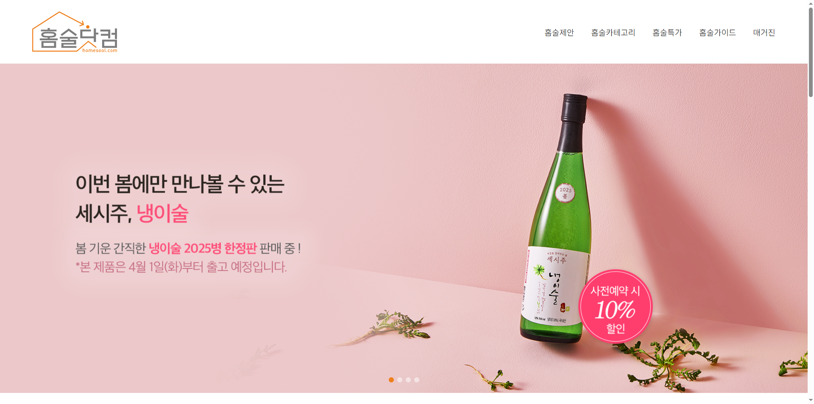

# 홍서희 포트폴리오
홍서희(Seohee Hong) - Hee-code 포트폴리오

# 자기소개
안녕하세요. **“배움의 즐거움을 아는”** 홍서희입니다.

5개월간 생성형 AI활용 UIUX 웹디자인/웹퍼블리셔 과정을 수강하였고, 8월 6일 수료 예정입니다.

HTML과 CSS를 중심으로 학습하며 웹 표준과 접근성의 중요성을 익혔고, 이를 바탕으로 웹사이트를 구현하는 역량을 키웠습니다.

또한, jQuery와 JavaScript의 기본적인 문법과 활용으로 간단한 동적 UI 요소도 구현 가능합니다.

저는 차분하고 침착한 성격으로, 꼼꼼함이 필요한 퍼블리싱 작업에 강점을 가지고 있습니다.

과정 중 진행한 팀 프로젝트를 통해 협업의 중요성을 경험했으며, 원활한 커뮤니케이션을 바탕으로 디자이너의 의도를 정확히 구현하는 퍼블리셔가 되고 싶습니다.

# 사용 가능 툴
Photoshop, Illustrator, Figma, HTML5, CSS3, jQuery, JavaScript, Swiper, React, Bootstrap, Notion

# 프로젝트
제가 진행했던 프로젝트들 입니다.

### 1. 포케올데이
포케올데이 공식 사이트 클론 코딩

- 개인 프로젝트
- 기간 : 2주
- 사용 툴 : HTML5, CSS3, jQuery, Swiper
- 링크 : https://hee-code.github.io/pokeallday/
  
포케올데이는 실제 서비스 중인 브랜드로, 감각적인 디자인과 직관적인 UI/UX를 갖춘 사이트입니다.

특히 슬라이드 효과, 반응형 레이아웃 등 다양한 요소가 잘 구현되어 있어 학습 가치가 높다고 판단하여 선택했습니다.

HTML과 CSS의 구조적 설계 능력 향상과 함께, jQuery를 활용한 동적 인터랙션 구현을 중심적으로 학습하고자 하였습니다.

### 2. 탐앤탐스
TOM N TOMS 공식 사이트 리뉴얼 (메뉴, 마이 탐 작업)

- 팀 프로젝트 (2인)
- 기간 : 4주
- 사용 툴 : Photoshop, Illustrator, HTML5, CSS3, jQuery, Figma
- 링크 : https://hee-code.github.io/tomntoms/

기존 탐앤탐스 공식 웹사이트는 브랜드 이미지에 비해 전체적인 UI와 정보 구조가 낡고 복잡한 느낌을 주고 있었습니다.

이러한 문제점을 개선하고, 사용자 중심의 인터페이스로 새롭게 설계해보고자 리뉴얼 대상으로 선정하였습니다.

팀원과의 협업을 통해 기획, 디자인, 퍼블리싱의 전체 과정을 경험하며 실무와 유사한 프로젝트 흐름을 익히는 것이 주요 목표였습니다.

특히 웹 접근성과 정보 전달의 명확성에 집중하여 HTML 구조와 CSS 설계 역량을 키우고자 하였습니다.

### 3. 에뛰드
에뛰드 공식 사이트 리뉴얼

- 개인 프로젝트
- 기간 : 2주
- 사용 툴 : Photoshop, HTML5, CSS3, jQuery, JavaScript, Swiper
- 링크 : https://hee-code.github.io/etude/

에뛰드는 통통 튀는 색감이 눈에 띄는 밝고 화려한 브랜드입니다.

하지만 기존 웹사이트는 다양한 콘텐츠와 비주얼 요소가 한 화면에 몰려 있어 중요한 정보가 눈에 띄지 않거나 시선이 분산되는 아쉬움이 있었습니다.

이러한 점을 개선하고자, 시각적으로 정돈된 레이아웃과 핵심 콘텐츠 중심의 구조로 리디자인을 진행하였습니다.

시각적 완성도와 브랜드 아이덴티티 전달에 중점을 두고, 정적인 웹사이트 안에서도 명확한 구조와 사용자 중심의 흐름을 구현하고자 하였습니다.

### 4. 온실
꽃 정기구독 사이트 제작 (메인 페이지 작업)

- 백엔드 협업 프로젝트
- 기간 : 6주
- 사용 툴 : Photoshop, HTML5, CSS3, jQuery, JavaScript, Figma, Swiper
- 링크 : https://hee-code.github.io/project_onsil/

기존의 화훼 관련 사이트들이 단순 판매만 하는 것과 달리, 감성적인 브랜드 이미지를 중심으로 꽃을 정기구독하는 형태의 온라인 서비스를 직접 기획하고 제작하였습니다.

브랜드명 ‘온실’은 일상 속 따뜻함과 여유를 전한다는 의미를 담고 있으며, 실존 브랜드가 아닌 처음부터 기획한 가상의 브랜드라는 점에서 기획력과 표현력 모두를 발휘할 수 있는 프로젝트였습니다.

퍼블리셔 4명과 백엔드 개발자 5명, 총 9명이 협업한 프로젝트로, 실제 서비스 제작 과정과 유사하게 역할을 나누어 작업했습니다.

저는 메인 페이지의 디자인 기획과 퍼블리싱을 담당하였으며, 브랜드의 감성적인 콘셉트가 잘 전달되는 화면을 구현하는 데 집중했습니다.

### 5. 홈술닷컴
홈술닷컴 공식 사이트 리뉴얼

- 개인 프로젝트
- 기간 : 1주
- 사용 툴 : HTML5, CSS3, Swiper
- 링크 : https://hee-code.github.io/homesool/

홈술닷컴은 다양한 전통주와 주류를 판매하는 실제 쇼핑몰 사이트입니다.

저는 브랜드의 개성을 살리면서도 사용자 중심의 UI로 개선해보고자 리디자인 및 퍼블리싱을 진행하였습니다.

시각적 흐름을 고려한 구조 설계, 사용자 친화적인 레이아웃, 그리고 다양한 디바이스에서도 안정적으로 작동하는 반응형 웹 구현을 목표로 하였습니다.

# JavaScript 프로젝트
JavaScript만을 사용해 제작한 간단한 프로젝트 입니다.

### 1. To-Do List
- 개인 프로젝트
- 사용 툴 : HTML5, CSS3, JavaScript
- 링크 : https://hee-code.github.io/to-do-list/

### 2. 카드 뒤집기 게임
- 개인 프로젝트
- 사용 툴 : HTML5, CSS3, JavaScript
- 링크 : https://hee-code.github.io/card/

# Contact
저에 대해 더 궁금하신 점이 있다면 언제든지 연락주세요!

- 이메일 : tet0012@naver.com
- 깃허브 : https://github.com/Hee-code
